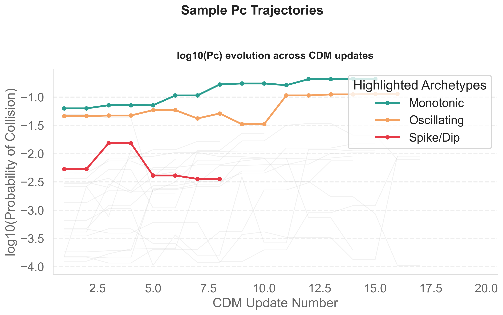

# Pc Maturation Patterns in LEO Conjunction Events

This started as part of building Conjunx, where I kept seeing Pc behave unpredictably across updates. 

This looks at how collision risk (**Pc**) actually changes across multiple CDM updates. I built this to understand whether early CDMs are actually useful for decision-making.

---

## Why this matters

Operators don’t act on a single CDM — they watch how risk evolves.

In practice:
- risk often increases late  
- sometimes it stabilizes  
- sometimes it fluctuates unpredictably  

This project answers a simple but important question:

> **Can early CDMs be trusted, or do operators need to wait?**



---

## Key Findings

From a dataset of high-risk LEO conjunction sequences:

- **56% of events (N=182/324)** end with a higher Pc than the initial warning  
  

- Pc typically stabilizes after **~4 updates**, but **16% (N=51/324)** never stabilize before TCA  
  

- When a clear trend appears early, it predicts the final direction with **77% accuracy (N=140/182)**  
  *(calculated only on events where a non-flat signal exists)*  
  

- Events involving active satellites behave differently **(N=324)**:
  - more oscillations  
  - slower convergence  
  - higher volatility  
  

**Important:**
> Early signals are useful — but they are absent in **44% of events (N=142/324)**.

---

## What Surprised Me: The Payload Volatility Problem

Going into this, I assumed active satellites (payloads) would have smoother, more predictable $P_c$ curves. After all, their ephemeris is constantly tracked and actively managed. 

The data showed the exact opposite: **payload-involved events are significantly more volatile and prone to oscillations than dead debris.**

**My Hypothesis:**  
Dead debris simply follows ballistic orbital mechanics, meaning its covariance propagation is mathematically stable. Active satellites, however, undergo routine station-keeping, drag make-up, and attitude adjustments. Even if a maneuver isn't explicitly for collision avoidance, these tiny orbital tweaks continuously perturb the state vector. Every minor operator-induced correction—or even just high-frequency tracking updates merged into the catalog—causes a shock to the covariance overlap, resulting in unpredictable swings in $P_c$.

---

## Operator Decision Flow

Based on these findings, a simple decision framework emerges:


---

## How it works

The pipeline is designed to be simple and modular.

### 1. Data Collection
Fetches CDMs from Space-Track and caches them locally (SQLite) to avoid repeated API calls.

### 2. Event Grouping
Since CDMs don’t include a true event ID, events are reconstructed using:
- object pair (SAT_1_ID, SAT_2_ID)
- TCA proximity (±15 minutes)

This builds a sequence of updates for each conjunction.

### 3. Filtering
Only keeps:
- LEO events  
- high-risk conjunctions (Pc ≥ 1e-4)  
- sequences with at least 3 CDMs  

### 4. Analysis
Each sequence is analyzed for:

- Direction of change (increase vs decrease)  
- Evolution shape (monotonic vs oscillating)  
- Stabilization behavior  
- Early prediction signal (first 3 CDMs)  
- Differences between:
  - Payload–Debris  
  - Debris–Debris  

### 5. Visualization
Generates charts for:
- Pc trajectories  
- stabilization patterns  
- prediction accuracy  
- object-type behavior  
- operator decision flow  

Outputs are saved to `output/charts/`.

---

## 🚀 Setup & Usage

### Prerequisites
- Python 3.10+
- Space-Track account

### Installation
```bash
pip install -r requirements.txt
```

Create a `.env` file:
```env
SPACETRACK_EMAIL=your_email@example.com
SPACETRACK_PASSWORD=your_password
```

### Run the pipeline
```bash
python fetch_cdms.py
python filter_sequences.py
python analyze_maturation.py
python visualize_maturation.py
```

---

## Output

- Clean dataset → `data/sequences_clean.json`  
- Charts → `output/charts/`  

---

## Notes

- CDM data is from the public Space-Track API (72h delayed)  
- Event grouping is approximate (no native conjunction ID)  
- Results focus on **LEO high-risk events**, not all conjunctions  

---

## Takeaway

This isn’t just about analyzing conjunctions — it’s about understanding **when the data becomes trustworthy**.

> Early signals can be powerful, but they’re not always present — and that uncertainty is where real operational decisions get difficult.
