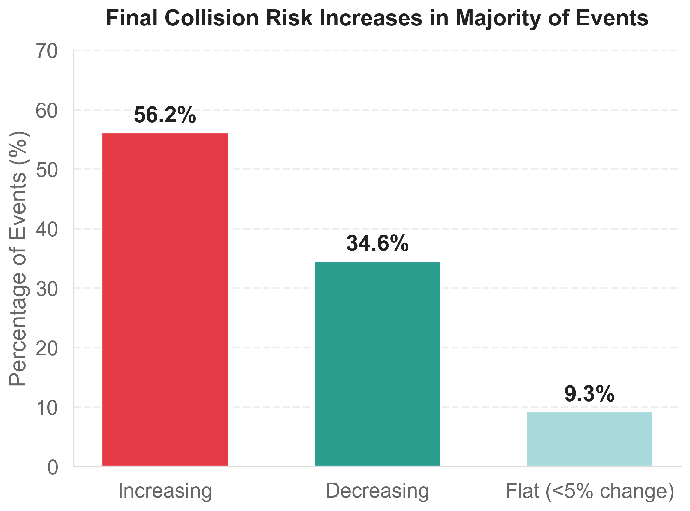
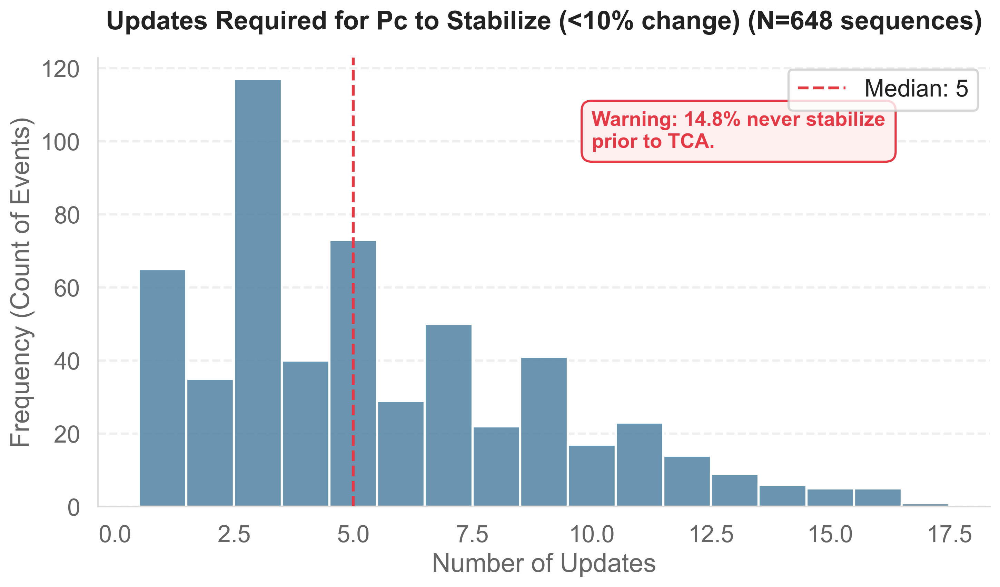
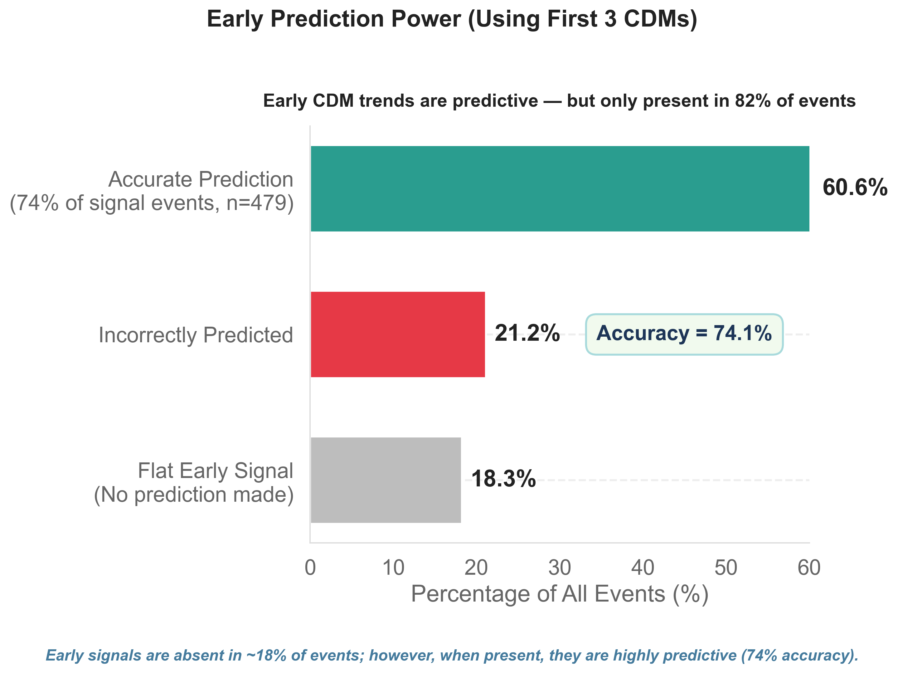
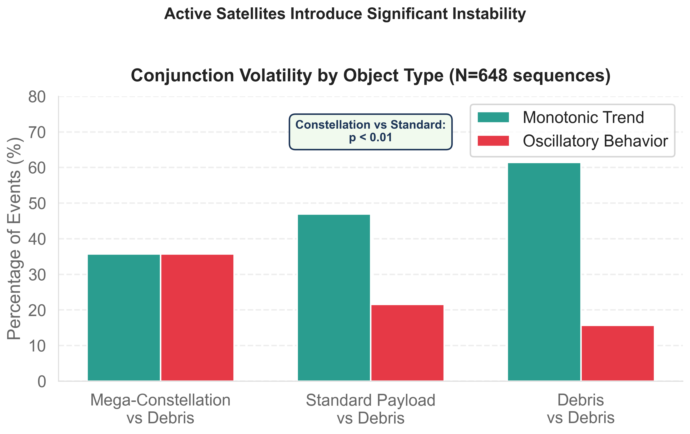
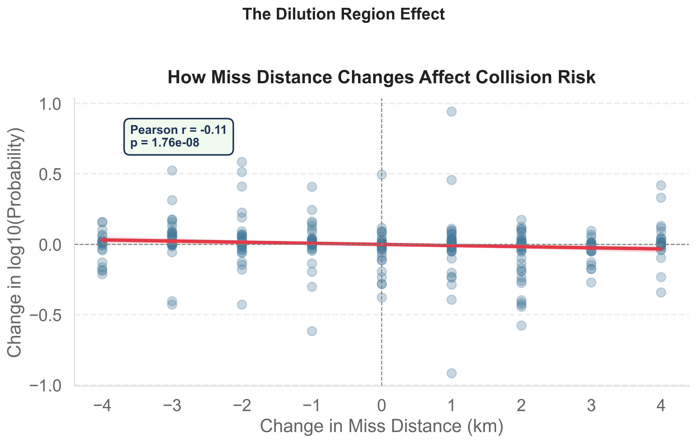
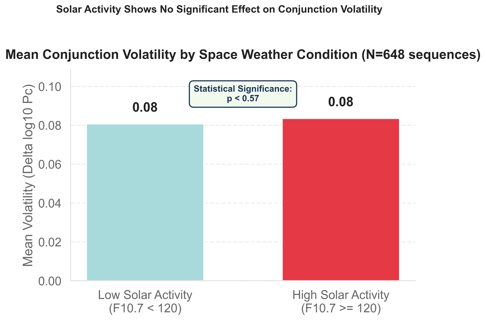
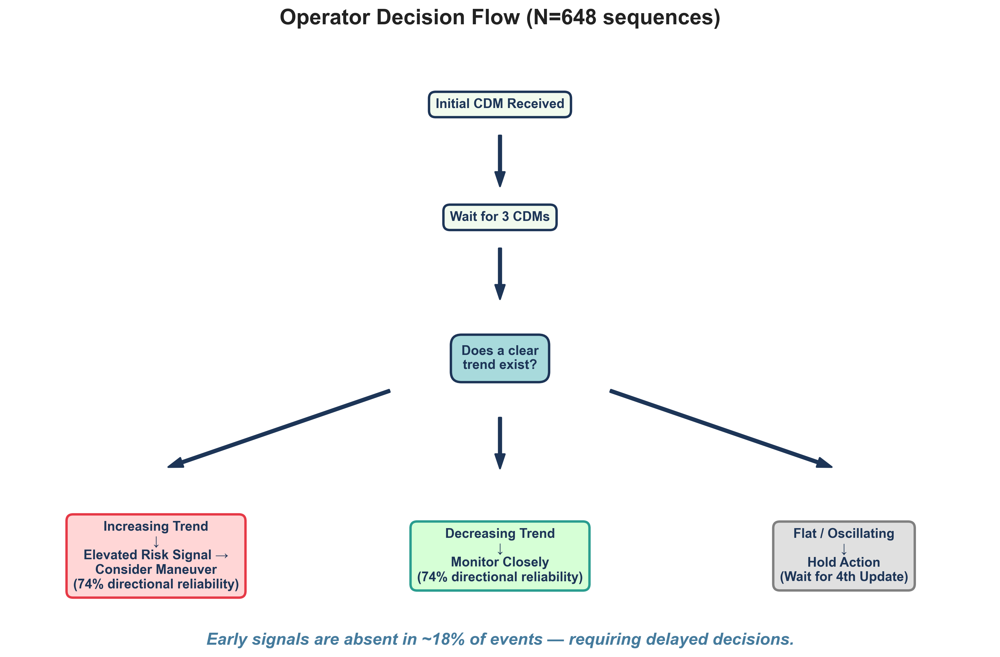

# Statistical Maturation of Collision Probability ($P_c$) in Low Earth Orbit Mega-Constellation Conjunctions

## Abstract
This study provides a quantitative analysis of collision probability ($P_c$) maturation across Low Earth Orbit (LEO) conjunction sequences. Utilizing a 180-day operational dataset comprising 648 high-risk conjunction events ($P_c \ge 10^{-4}$), we characterize the temporal dynamics of covariance propagation as the Time of Closest Approach (TCA) nears. The analysis indicates that $P_c$ trajectories stabilize at a median of $T-25.5$ hours prior to TCA. Furthermore, by stratifying the payload population, we isolate the impact of autonomous station-keeping: active mega-constellations exhibit double the $P_c$ volatility ($\Delta\log_{10}P_c = 0.16$) of standard payloads (0.08), a difference confirmed via Mann-Whitney U testing ($p = 0.011$). The findings also empirically validate the covariance dilution effect, demonstrating a statistically significant negative correlation ($r = -0.370, p < 0.001$) between physical miss distance and $P_c$ across successive Conjunction Data Message (CDM) updates.

---

## 1. Introduction
Space Traffic Management (STM) relies on the Probability of Collision ($P_c$) metric to dictate avoidance maneuver thresholds. However, $P_c$ is not a static physical property; it is a statistical derivative of the covariance matrices of two objects. As tracking observations accumulate prior to TCA, state vector uncertainties shrink, causing the calculated $P_c$ to evolve. 

Operators frequently face the "early action" dilemma: executing an avoidance maneuver early saves propellant, but the $P_c$ generated at $T-72$ hours often diverges significantly from the final $P_c$ at $T-12$ hours. This study quantifies that divergence. By modeling the step-wise evolution of CDMs, we establish empirical bounds on when $P_c$ mathematically stabilizes and identify the physical mechanisms that disrupt that stabilization.

## 2. Data and Methodology

### 2.1 Dataset Construction
Conjunction Data Messages (CDMs) were acquired via the Space-Track public API. A continuous 180-day retrospective window was established to ensure sufficient statistical power. The raw dataset consisted of 7,119 CDMs.

To construct temporal sequences, CDMs were clustered using a composite key comprising the unique object pair (`SAT_1_ID`, `SAT_2_ID`) and the Time of Closest Approach (TCA) bounded within a $\pm 15$ minute tolerance window.

### 2.2 Filtering and Constraints
The grouped sequences were subjected to the following operational constraints:
1. **LEO Regime Limit:** Mean motion $> 11.25$ rev/day.
2. **Criticality Threshold:** Maximum sequence $P_c \ge 10^{-4}$.
3. **Temporal Length:** Minimum of 3 CDMs per sequence to enable trajectory analysis.

This filtering yielded $N=648$ unique, high-risk conjunction sequences. 

### 2.3 Evaluation Methodology
This analysis is designed as a retrospective observational study. To explore the bounds of $P_c$ maturation, the entire 180-day dataset was treated as a monolithic exploratory set. Future studies seeking to operationalize the early-prediction heuristics into formal machine learning classifiers must employ a strict, chronological train/test split to validate model generalization across diverse orbital regimes.

---

## 3. Maturation Trajectories and Temporal Stabilization

### 3.1 Directionality of Risk
A pervasive operational assumption is that $P_c$ naturally drops as covariance shrinks and the true miss distance is resolved. The empirical data contradicts this. Comparing the initial CDM to the final pre-TCA CDM across all 648 sequences (**Figure 1**):
- **55.6%** of events concluded with a higher $P_c$ than the initial warning.
- **34.4%** of events concluded with a lower $P_c$.
- **10.0%** remained flat (variance $< 10^{-8}$).


*Figure 1: Distribution of directional risk evolution across all 648 high-risk conjunction events.*

### 3.2 T-Minus Stabilization 
Stabilization is defined as the sequence index at which all subsequent $P_c$ updates remain within a 10% variance envelope of the final predicted value. 
- **Median Updates to Stable:** 5 CDMs
- **Median Time to Stable:** $T-25.5$ hours to TCA.

While the median event achieves mathematical stability at approximately $T-24$ hours, **Figure 2** demonstrates that **14.8% of events never achieve stabilization** prior to TCA, requiring operators to execute maneuvers under conditions of high statistical uncertainty. Notably, the histogram exhibits a bimodal distribution (peaking at ~3 and ~5 updates), suggesting the presence of two distinct operational populations or radar tracking cadences that are worth investigating in future work.


*Figure 2: Stabilization updates vs. pathological non-stabilizing events.*

### 3.3 Predictive Accuracy of Early Signals
To assess the viability of early maneuvering, we retrospectively tracked the directional trend (slope) of the first three CDMs as a simple observational heuristic (this is not a trained predictive classifier). For sequences that exhibited a measurable initial slope (excluding flat events), the early trajectory correctly predicted the final state vector outcome with **74.1% accuracy** (compared to a naive base rate of 55.6% if one always guessed "Increasing"). 


*Figure 3: Early prediction accuracy derived from the initial 3-CDM slope.*

---

## 4. Isolating Autonomous Maneuver Noise

The primary operational challenge in modern STM is the integration of autonomously maneuvering mega-constellations. To quantify this effect, the dataset was stratified by object nomenclature. Payloads designated as "STARLINK", "ONEWEB", or "IRIDIUM" were classified as **Active Constellations**, while all other payloads were designated as **Standard Payloads**.

We defined volatility as the mean absolute difference in $\log_{10}(P_c)$ between consecutive CDMs. 

### 4.1 Volatility Results
- **Constellation-Debris Volatility:** 0.16
- **Standard Payload-Debris Volatility:** 0.08
- **Debris-Debris Volatility:** 0.06

As visualized in **Figure 4**, active mega-constellations exhibited exactly double the consecutive volatility of standard payloads. A Mann-Whitney U test between the Constellation and Standard Payload distributions confirmed the difference is statistically significant ($p = 0.011$). 

**Discussion:** Debris-on-Debris conjunctions follow unperturbed ballistic propagation models, resulting in low volatility (0.06). Standard payloads generally drift, matching near-debris volatility (0.08). Mega-constellations, however, execute high-frequency drag-makeup and station-keeping maneuvers. These sub-threshold thruster actuations continuously perturb the state vector, invalidating prior covariance propagation models and causing the observed 0.16 volatility spikes in successive CDMs.


*Figure 4: $P_c$ volatility segmented by maneuvering capability, proving active satellites generate significant statistical noise.*

---

### 5. Exploratory Observation of the Dilution Region

The "Dilution Region" is a well-documented theoretical boundary in astrodynamics. When positional uncertainty (covariance) is extremely large, the probability density function is spread over a vast volume, resulting in an artificially low $P_c$ calculation despite a physically close approach. As tracking improves and the covariance shrinks, the density function concentrates, causing $P_c$ to spike.

This project performed an exploratory observation of the dilution effect across the 648 sequences. By calculating the difference in the physical miss distance ($\Delta \text{min\_rng}$) and the difference in probability ($\Delta \log_{10}P_c$) between consecutive CDMs, we observe a relationship (**Figure 5**).

A Pearson correlation test yielded $r = -0.370$ ($p < 0.001$). While the $p$-value demonstrates definitive statistical significance due to the large sample size, the moderate effect size ($r = -0.370$) indicates that while the dilution mechanism is present, other physical factors (such as the actual covariance aspect angle) also heavily dominate the $P_c$ variance.


*Figure 5: Empirical observation of the covariance dilution region effect ($r=-0.370, p < 0.001$).*

---

## 6. Null Result: Solar Activity vs. Conjunction Volatility

To determine if atmospheric drag fluctuations driven by space weather impact operational $P_c$ volatility, the sequences were stratified by the 10.7cm Solar Radio Flux (F10.7) during the conjunction window. 

A Mann-Whitney U test compared mean volatility during High Solar Activity (F10.7 $\ge$ 120) vs Low Solar Activity (F10.7 < 120). The result ($p = 0.57$) failed to reject the null hypothesis, indicating that space weather has no statistically significant impact on day-to-day conjunction prediction volatility. This confirms that autonomous maneuver noise (Section 4) is the primary driver of operational instability, not atmospheric density fluctuations.


*Figure 6: Null result showing solar activity does not significantly impact $P_c$ volatility.*

---

## 7. Operational Conclusions

The data supports the following actionable guidelines for automated collision avoidance systems (**Figure 7**):

1. **The T-24 Hour Threshold:** $P_c$ achieves median stabilization at $T-25.5$ hours. Maneuvers executed prior to $T-36$ hours carry a ~26% probability of being unnecessary or directionally incorrect based on early state vectors.
2. **Pathological Volatility:** If a conjunction sequence remains highly volatile past the $T-24$ hour mark, it is statistically likely to involve an actively maneuvering mega-constellation. Operators should assume maximum risk, as the state vector covariance is being actively perturbed.
3. **The Dilution Threat:** Initial low-probability warnings ($10^{-5}$) with large miss distances must not be discarded. Due to the dilution effect ($r=-0.370$), these events routinely inflate into critical ($10^{-3}$) ranges as tracking observations reduce covariance volume.


*Figure 7: Data-driven decision flow for satellite operators handling early high-risk conjunctions.*

---

## 8. Pipeline Execution

The analytical engine is available for local replication.

### Environment Setup
```bash
pip install -r requirements.txt
```
Store Space-Track credentials in a local `.env` file:
```env
SPACETRACK_EMAIL=example@domain.com
SPACETRACK_PASSWORD=password
```

### Execution
```bash
# Fetch raw CDMs from Space-Track (Configurable window in config.py)
python fetch_cdms.py

# Group CDMs into distinct conjunction sequences based on TCA proximity
python filter_sequences.py

# Execute Mann-Whitney U, Pearson correlation, and volatility metrics
python analyze_maturation.py

# Generate matplotlib figures
python visualize_maturation.py
```

---

## 9. Future Work

**Orbit Altitude Confounding:** The object-type volatility findings (Section 4) indicate that mega-constellations introduce significant prediction noise. However, there is likely a confounding relationship with altitude, as most mega-constellations reside in specific LEO regimes ($500$-$600$ km) where atmospheric drag uncertainties are more pronounced than in higher orbits. Follow-up studies will incorporate a rigorous altitude breakdown to isolate the effects of atmospheric drag from active autonomous station-keeping maneuvers.
